# 🌐 Swipe Landing Page

A modern and responsive fintech landing page, built using pure HTML, CSS, and minimal JavaScript.


## ⚙️ Features

- Fully responsive design
- Mobile sidebar navigation
- Smooth hover and button animations
- CSS Grid and Flexbox layouts
- Reusable utility classes
- Clean component-based structure
- Modern UI inspired by fintech platforms

## 📚 Tech Stack

- HTML5
- CSS3
- Vanilla JavaScript


## 📂 Folder Structure

```bash
SWIPE/
│
├── assets/ # For icons, images, and logos used
│   ├── logo-white.svg
│   ├── hero-phone.png
│   ├── api-code.png
│   └── ...
│
├── screenshots/ # Screenshots used in readme.md demo section
│   ├── homepage.png
│   ├── mobile-view.png
│   └── ...
│  
├── index.html
├── styles.css
├── main.js
└── readme.md # This file
```

## ℹ️ Getting Started

### Clone the repository

```bash
git clone https://github.com/ManarMerhiMM/SWIPE.git
```

### Open the project

Simply open `index.html` in your browser. Alternatively, you can use VS Code to open `index.html` with live server.


## ↗️ Customization

You can easily customize:

- Colors
- Fonts
- Layout spacing
- Animations
- Images and branding


## 🔎 Future Improvements

- Add dark mode
- Add smooth scrolling
- Add GSAP animations


## ✏️ Author

Created by Manar Merhi.
 

## 🪪 License

This project is open source

## 📺 Demo

### Desktop

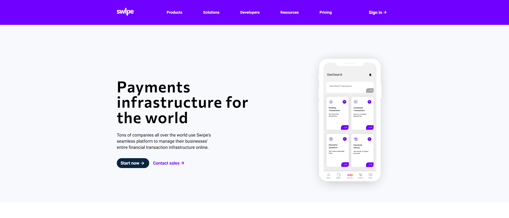
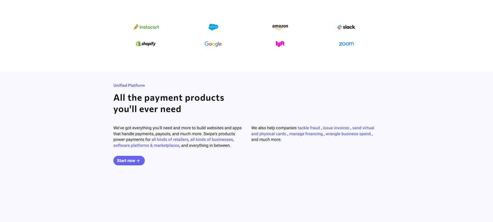
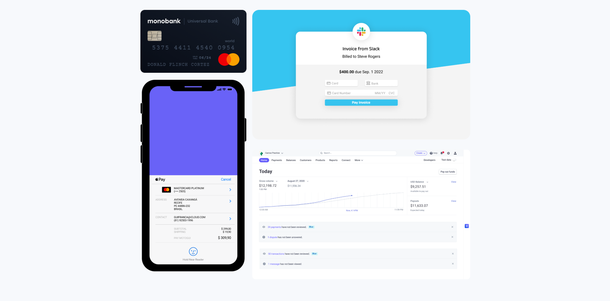
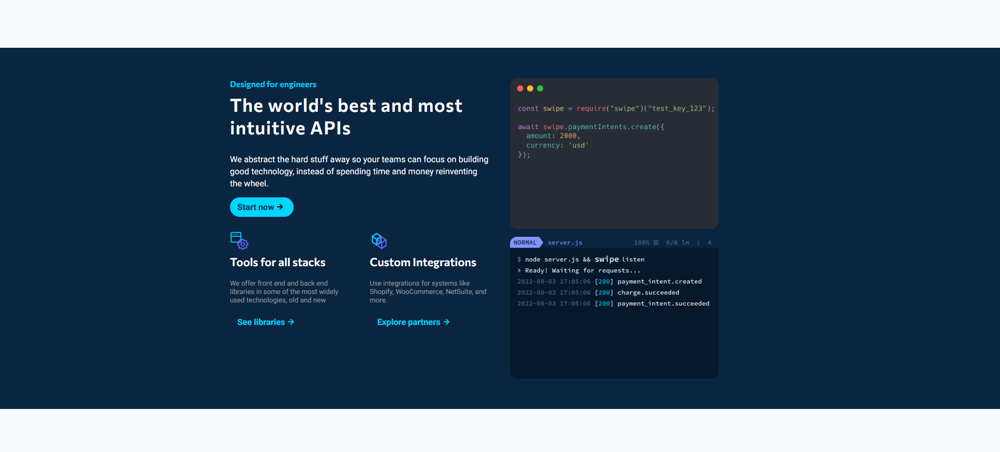
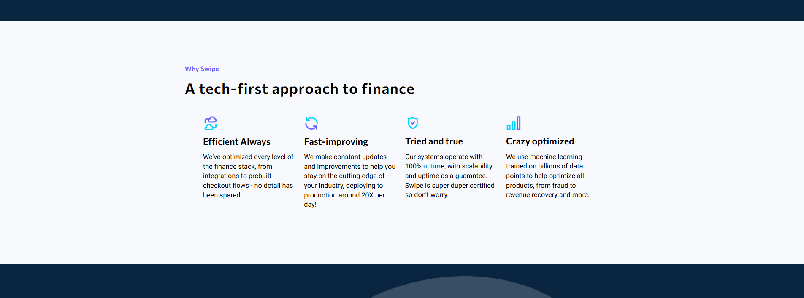
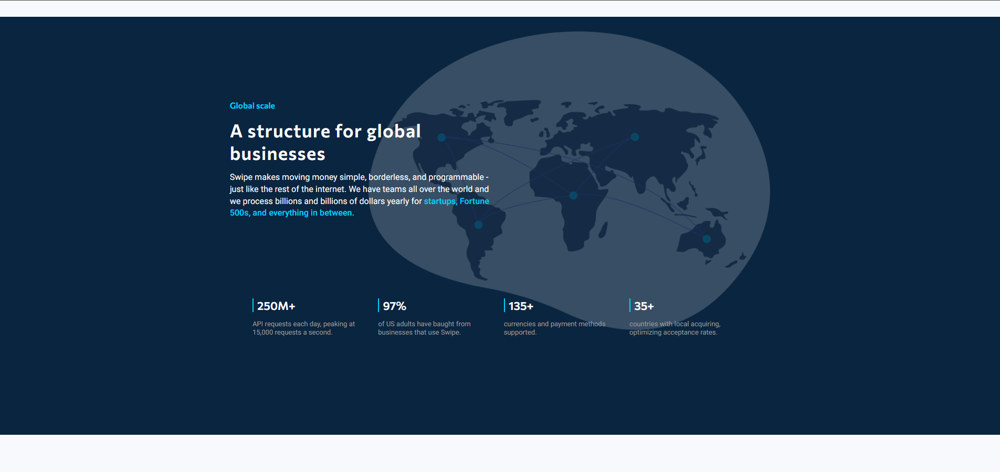
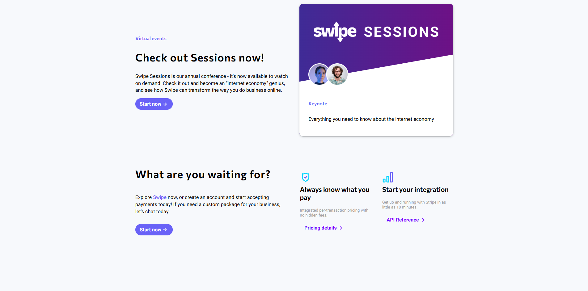


---

### iPad Air


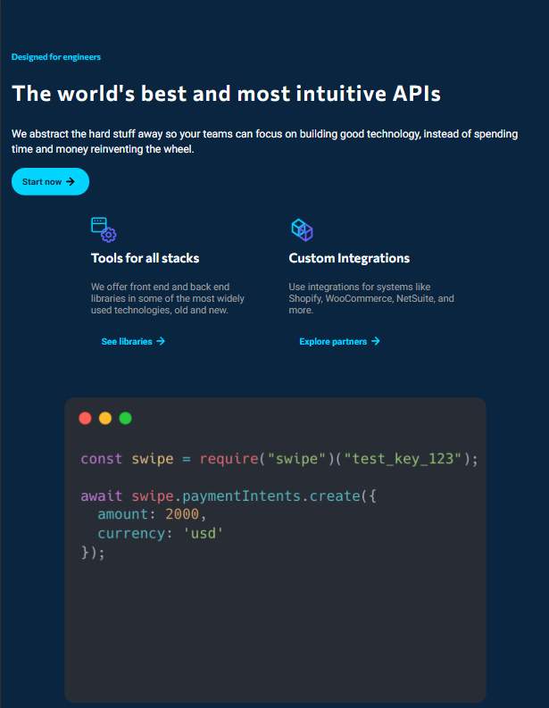
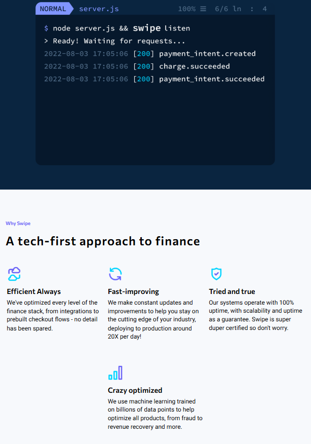


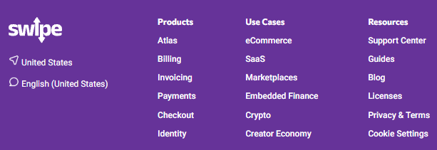

---

### iPhone 14 Pro Max

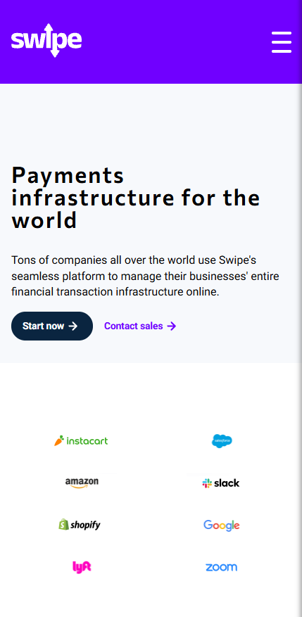
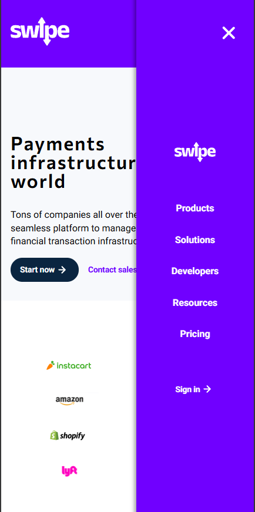

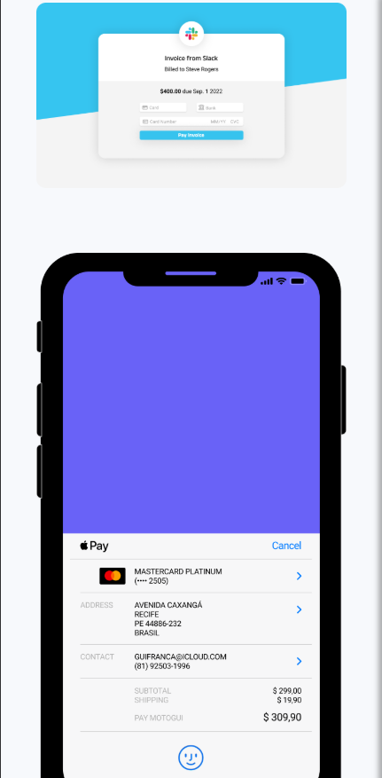
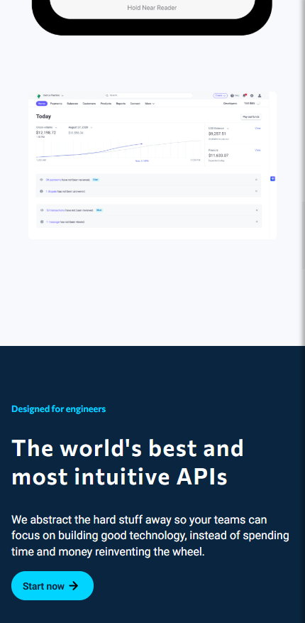
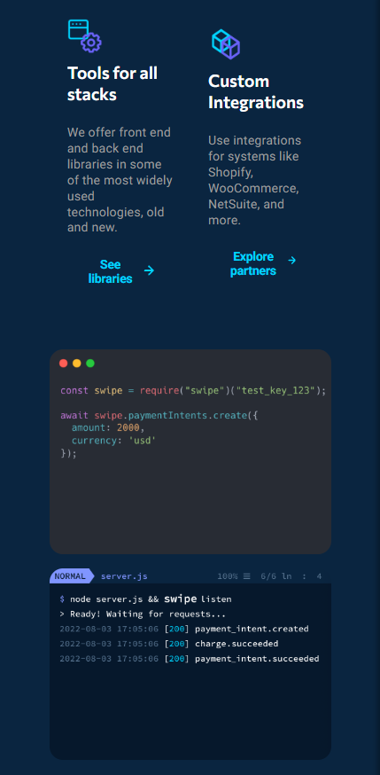
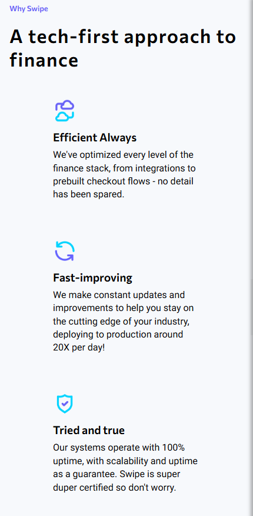

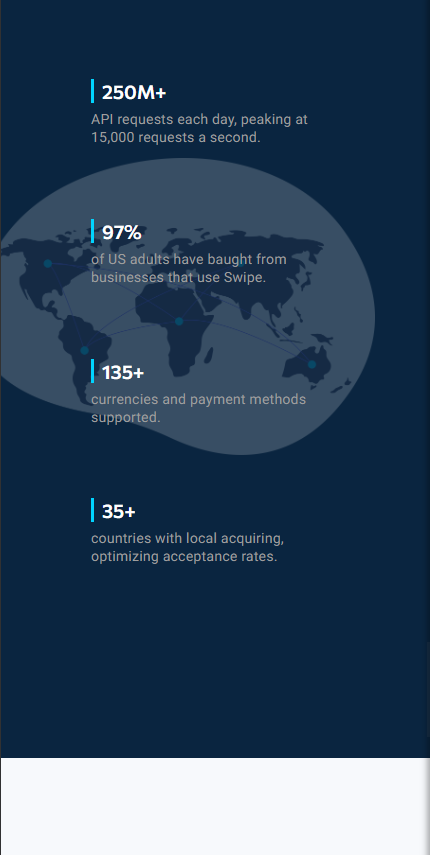

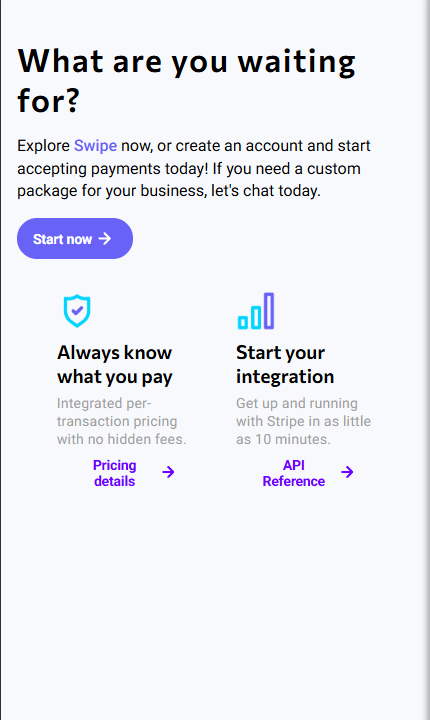
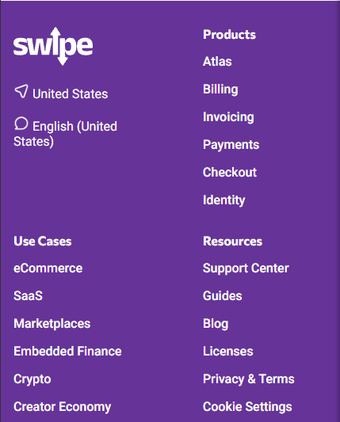